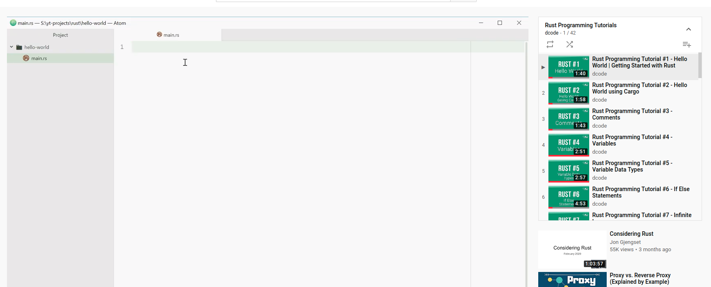

I'm currently following Dcode's [tutorial](https://www.youtube.com/watch?v=vOMJlQ5B-M0&list=PLVvjrrRCBy2JSHf9tGxGKJ-bYAN_uDCUL) to learn all the basics about Rust.

It gives all the basic knowledge about Rust :

* How to use Cargo
* Variable data types
* Functions
* Structs 
* etc ...

Note : This tutorial does not teach you ownership or things like panic error.

Thanks to Dcode's youtube [channel](https://www.youtube.com/channel/UCjX0FtIZBBVD3YoCcxnDC4g/featured)

